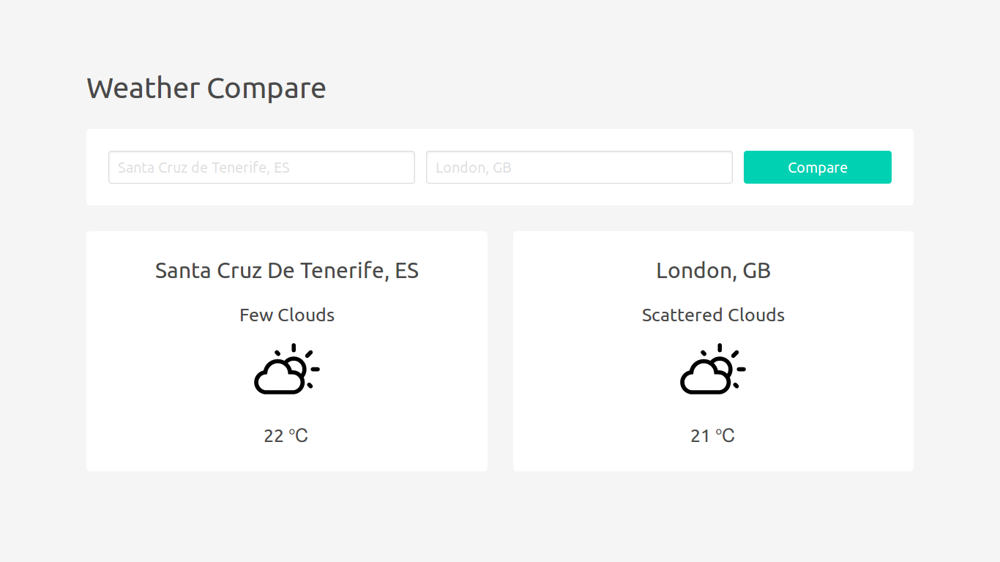

# React Weather Compare

A simple React web app to compare the current weather of two cities. I also built a [vanilla JS version](https://github.com/lujanfernaud/js-weather-compare).

## Demo

[lujanfernaud.com/react-weather-compare](http://lujanfernaud.com/react-weather-compare/)

## Built With

- [React 16](https://reactjs.org/)
- [Weatherbit API](https://www.weatherbit.io/api)
- [Local Storage](https://developer.mozilla.org/en-US/docs/Web/API/Storage/LocalStorage)
- [Weather Icons](https://github.com/erikflowers/weather-icons)
- [Bulma](https://bulma.io/)

## Screenshot

<kbd>
  
</kbd>
